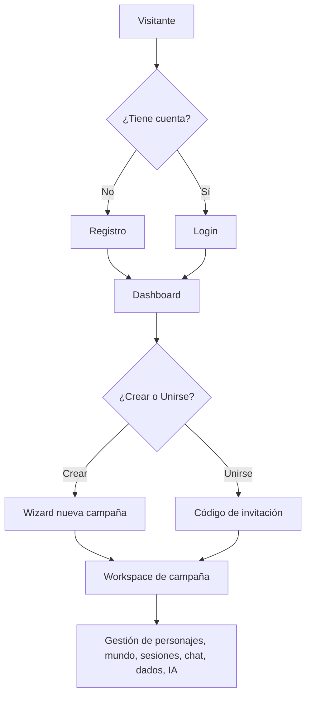

# CampaignForge — Alcance Funcional

**Versión:** 1.1 | **Última actualización:** 2026-06-04

---

## Descripción del sistema

CampaignForge es una plataforma web multijugador para la gestión integral de campañas de juegos de rol (TTRPG). Permite a narradores (másters) crear y administrar campañas, y a jugadores participar en ellas con fichas de personaje, acceso a lore, chat y tiradas de dados.

---

## Actores del sistema

| Actor | Descripción |
|-------|-------------|
| **Máster** | Creador y administrador de la campaña. Acceso total a todos los módulos, incluidos PNJs ocultos, IA Forge y configuración. |
| **Jugador** | Miembro de una campaña por invitación. Acceso a personajes propios, lore pública, chat, dados y sesiones. |
| **Visitante** | Usuario no autenticado. Solo accede a la landing page y formularios de auth. |

---

## Módulos en scope (v1.x)

### 1. Autenticación
- Registro con email, nombre real y alias (displayName)
- Login con email/contraseña (JWT + cookie httpOnly)
- Cierre de sesión
- Cambio de contraseña y nombre visible desde perfil
- Redirección automática si no autenticado

### 2. Dashboard
- Vista de campañas donde el usuario es máster
- Vista de campañas donde el usuario es jugador
- Estadísticas rápidas (campañas, sesiones, miembros)
- Acciones rápidas (nueva campaña, unirse con código)
- Estado de campaña activa/inactiva visual

### 3. Gestión de campañas
- Creación wizard 3 pasos: nombre+descripción → tema → sistema de juego
- Temas disponibles: Fantasy, Horror, SciFi, Grimdark, Steampunk, Western, Modern, PostApocalyptic, Custom
- Sistemas: D&D 5e, Pathfinder 2e, Call of Cthulhu, Vampire: La Mascarada, Shadowrun, Starfinder, Custom
- Código de invitación único por campaña
- Unirse a campaña con código de invitación
- Visibilidad pública/privada de campaña
- Tema visual dinámico (modifica CSS variables según el tema elegido)

### 4. Workspace de campaña
- Layout con sidebar colapsable (240px ↔ 64px en desktop, overlay en mobile)
- TopNav con breadcrumb, dados rápidos, asistente IA y perfil
- 15 secciones navegables en sidebar
- Página de overview con stats, quests activas, miembros y sesiones recientes

### 5. Personajes (Characters)
- Fichas de personaje completas adaptables a cualquier sistema
- Estadísticas (STR, DEX, CON, INT, WIS, CHA), HP, CA, velocidad
- Skills y saving throws
- Inventario con ítems equipados
- Hechizos por nivel
- Relaciones con otros personajes (aliado, enemigo, rival, etc.)
- Retrato/avatar del personaje

### 6. PNJs (NPCs)
- Creación con nombre, descripción, comportamiento, secretos
- Visibilidad configurable: pública (jugadores la ven) u oculta (solo máster)
- Etiquetas de clasificación
- Retrato/avatar

### 7. Monstruos
- Ficha de monstruo con estadísticas, CR, tipo, habilidades especiales
- Acciones y acciones legendarias
- Notas del máster

### 8. Mundo (World)
- **Locaciones**: jerarquía de regiones/zonas, descripción, secretos, imagen
- **Facciones**: nombre, objetivos, alineamiento, relaciones con otras facciones
- **Items**: nombre, tipo, rareza, propiedades, valor, ¿es artefacto?
- **Quests**: principal/secundaria/personal, objetivos, estado, recompensa

### 9. Sesiones (Sessions)
- Registro de sesiones con fecha, título, resumen manual
- Estado: planned, in-progress, completed
- Resumen automático via IA (GPT-4o)
- Highlights y notas post-sesión

### 10. Lore / Wiki
- Entradas de lore con título, contenido, categoría
- Categorías: Historia, Geografía, Personajes, Magia, Religión, Política, Otros
- Etiquetas libres
- Visibilidad por rol

### 11. Galería (Gallery)
- Subida de imágenes y ayudas visuales
- Organización por tipo (mapa, portrait, handout, etc.)

### 12. Notas (Notes)
- Notas privadas del máster o del jugador
- No compartidas entre roles

### 13. Chat
- Salas de chat: pública, privada, solo máster
- Mensajes de texto y resultados de dados
- Timestamps

### 14. Dados (Dice)
- Dado d4, d6, d8, d10, d12, d20, d100
- Historial de tiradas (últimas 50)
- Panel flotante en el workspace
- Dados en topnav para acceso rápido

### 15. IA Forge (solo Máster)
- Generador de NPCs completos
- Generador de monstruos/encuentros
- Generador de quests
- Generador de locaciones
- Generador de objetos/artefactos
- Resúmenes de sesión

### 16. Asistente del Máster (solo Máster)
- Chat contextual con GPT-4o
- Conoce la campaña (nombre, tema, sistema)
- Flotante en el workspace

---

## Fuera de scope (v1.x) — Planificado para versiones futuras

| Funcionalidad | Versión estimada |
|---------------|-----------------|
| Mapas interactivos con fog of war | v2.x |
| Chat en tiempo real (WebSocket/Supabase Realtime) | v2.x |
| Generación de imágenes con DALL-E 3 | v2.x |
| Timeline interactiva de la campaña | v2.x |
| Upload de imágenes con UploadThing/Cloudinary | v2.x |
| Export PDF de fichas de personaje | v2.x |
| Sistema de notificaciones push | v2.x |
| Modo presentación (pantalla compartida) | v3.x |
| App mobile nativa | v3.x |
| Integración con Roll20 / Foundry VTT | v3.x |

---

## Reglas de negocio clave

1. Solo el máster puede acceder a IA Forge, ver PNJs ocultos y configurar la campaña.
2. Un usuario puede ser máster de múltiples campañas y jugador de múltiples campañas simultáneamente.
3. Los jugadores se unen a campañas exclusivamente por código de invitación.
4. Los personajes pertenecen a una campaña, no a un usuario globalmente.
5. Los dados pueden usarlos todos los miembros de la campaña.
6. El asistente IA solo es accesible por el máster.
7. Las notas son privadas por rol (máster ve las suyas, jugadores las suyas).
8. Una campaña tiene exactamente un máster y puede tener N jugadores.

---

## Flujo de usuario principal

