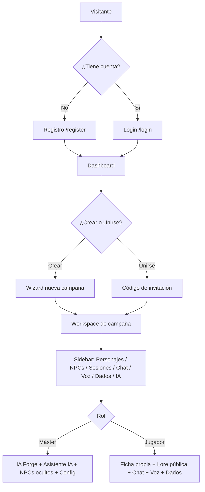

# CampaignForge — Alcance Funcional

**Versión:** 2.4 | **Última actualización:** 2026-06-09

---

## Descripción del sistema

CampaignForge es una plataforma web multijugador para la gestión integral de campañas de juegos de rol (TTRPG). Permite a narradores (másters) crear y administrar campañas, y a jugadores participar en ellas con fichas de personaje, acceso a lore, chat en tiempo real, voz y tiradas de dados.

---

## Actores del sistema

| Actor | Descripción |
|-------|-------------|
| **Administrador** | Rol global de cuenta (`User.role = ADMIN`). Accede al panel `/admin` y habilita/inhabilita a otros usuarios como másters. Se otorga por la allowlist de entorno `ADMIN_EMAILS`. |
| **Máster** | Rol global `MASTER`: puede crear y mastear sus propias campañas. Dentro de una campaña que crea, tiene acceso total (NPCs ocultos, IA Forge, asistente, configuración). En campañas ajenas entra como jugador. |
| **Jugador** | Rol global `PLAYER` (default de toda cuenta nueva): solo se une a campañas ajenas por invitación. Acceso a personajes propios, lore pública, chat, dados, sesiones y voz. No puede crear campañas. |
| **Visitante** | Usuario no autenticado. Solo accede a la landing page y formularios de auth. |

> **Dos niveles de rol (no confundir):** el **rol global** (`User.role`) es la *capacidad de cuenta* — quién puede crear campañas y quién administra. El **rol por campaña** (`CampaignMember.role`: MASTER/PLAYER/SPECTATOR) define qué es el usuario *dentro* de cada campaña. Un mismo usuario con rol global MASTER es `CampaignMember.MASTER` en sus campañas y `CampaignMember.PLAYER` en las ajenas.

---

## Módulos en scope (v2.x)

### 1. Autenticación
- Registro con email, nombre real y alias (displayName)
- Login con email/contraseña (JWT + cookie httpOnly)
- Cierre de sesión (redirige a la home)
- Cambio de contraseña y nombre visible desde perfil
- Redirección automática si no autenticado; usuario logueado en `/` va al dashboard
- Toda cuenta nueva nace con rol global `PLAYER`; la allowlist `ADMIN_EMAILS` promueve a `ADMIN` en registro/login

### 2. Dashboard
- Vista de campañas donde el usuario es máster (aparece primero)
- Vista de campañas donde el usuario es jugador
- Estadísticas compactas al pie (campañas, sesiones, miembros)
- Acciones rápidas: nueva campaña, unirse con código

### 3. Gestión de campañas
- **Solo usuarios con rol global MASTER o ADMIN** pueden crear campañas (gate en UI, API y ruta)
- Creación wizard 3 pasos: nombre+descripción+visibilidad → temas+tonos → sistemas
- Paso 1: nombre obligatorio (con contador `maxLength`), descripción opcional, switch ON/OFF de campaña pública; "Siguiente" deshabilitado si faltan obligatorios
- Paso 2 (multi-select): **temas visuales** (Fantasy, Horror, SciFi, Grimdark, Steampunk, Modern, PostApocalyptic, Custom) + **tonos narrativos** (Épico, Oscuro, Heroico, Cómico, Político, Misterio, Supervivencia, Romántico)
- Paso 3 (multi-select): **sistemas combinables** (D&D 5e, Pathfinder 2e, Call of Cthulhu, Vampire: La Mascarada, Shadowrun, Starfinder, Custom)
- Persistencia: valor principal en `theme`/`system` (enum) + selección completa en `settings` (Json)
- Código de invitación único por campaña
- Tema visual dinámico (modifica CSS variables según el tema principal elegido)
- *Pendiente (documentado):* al seleccionar un sistema, traer su manual desde Google Drive a la Wiki

### 3b. Panel de administración (`/admin`, solo ADMIN)
- Tabla de usuarios: identidad (avatar, displayName, username, email), badge de rol y fecha de registro
- Switch por usuario para habilitar/inhabilitar como máster (PLAYER ↔ MASTER)
- El rol ADMIN no se asigna desde la UI (solo por `ADMIN_EMAILS`); las filas de admins y la propia quedan bloqueadas
- Degradar un máster es no destructivo: solo bloquea crear nuevas campañas, las existentes siguen

### 4. Workspace de campaña
- Layout con sidebar colapsable (240px ↔ 64px en desktop, overlay en mobile)
- TopNav con breadcrumb, asistente IA y perfil
- 8 contadores compactos (chips) para todos los módulos en la página de overview
- Bandeja de dados persistente en el borde derecho (visible desde cualquier sección)

### 5. Personajes (Characters)
- Fichas de personaje completas adaptables a cualquier sistema
- Estadísticas (STR, DEX, CON, INT, WIS, CHA), HP, CA, velocidad
- Skills, saving throws, inventario, hechizos, relaciones
- Retrato/avatar del personaje
- Notificación realtime al máster cuando se crea un personaje

### 6. NPCs
- Creación con nombre, descripción, comportamiento, secretos
- Visibilidad configurable: pública u oculta (solo máster)
- Etiquetas de clasificación
- Retrato/avatar

### 7. Monstruos
- Ficha con estadísticas, CR, tipo, habilidades especiales
- Acciones y acciones legendarias

### 8. Mundo (World)
- **Locaciones**: jerarquía de regiones/zonas
- **Facciones**: nombre, objetivos, alineamiento
- **Items**: rareza, propiedades JSON
- **Quests**: principal/secundaria/personal, estado, recompensa

### 9. Sesiones
- Registro con fecha, título, resumen manual
- Estado: planned, in-progress, completed
- Resumen automático via IA (Gemini 2.0 Flash)
- Highlights y notas post-sesión

### 10. Lore / Wiki
- Entradas con título, contenido, categoría y etiquetas
- Visibilidad por rol

### 11. Galería (Gallery)
- Subida de imágenes y ayudas visuales
- La imagen pública más reciente aparece como fondo del chat

### 12. Notas (Notes)
- Notas privadas del máster o del jugador (no compartidas)

### 13. Chat en tiempo real ✅
- Salas de chat de texto por campaña (inicialización automática)
- Mensajes de texto en tiempo real via Pusher Channels
- Renders diferenciados para mensajes de texto y tiradas de dados
- Badge de no leídos en el sidebar cuando el usuario está en otra sección
- Historial persistente en base de datos

### 14. Canales de voz (LiveKit) ✅ sidebar
- Canales de voz integrados en el sidebar de campaña (General + Dungeon por defecto)
- Conexión/desconexión desde el sidebar
- Estado de conexión, mute y deafen persistidos en Zustand
- Token generado por el servidor via `livekit-server-sdk`

### 15. Dados (Dice)
- Dado d4, d6, d8, d10, d12, d20, d100 con modificadores
- Historial de tiradas (últimas 50) en sesión
- **Bandeja flotante** en el borde derecho, visible desde cualquier sección
- Las tiradas se envían automáticamente al chat si el usuario está en la página de chat
- Máster puede ocultar sus tiradas a los jugadores (switch en la bandeja)

### 16. IA Forge (solo Máster)
- Generador de NPCs, monstruos, quests, locaciones, objetos y resúmenes
- Modelo: Gemini 2.0 Flash con respuesta JSON nativa

### 17. Asistente del Máster (solo Máster)
- Chat contextual con Gemini 2.0 Flash
- Conoce la campaña (nombre, tema, sistema)
- Panel flotante en el workspace
- Historial de conversación en la sesión

---

## Fuera de scope (v2.x) — Planificado para versiones futuras

| Funcionalidad | Versión estimada |
|---------------|-----------------|
| Mapas interactivos con fog of war | v3.0 |
| Upload real de imágenes (Cloudinary integrado) | v2.x |
| Export PDF de fichas de personaje | v3.0 |
| Generación de imágenes con IA | v3.0 |
| Timeline interactiva | v3.0 |
| Sistema de notificaciones push (campana) | v2.x |
| Historial de tiradas de dados por campaña/sesión | v2.x |
| Modo presentación (DM screen) | v3.0 |
| App mobile nativa | v4.0 |
| Integración con Roll20 / Foundry VTT | v4.0 |

---

## Reglas de negocio clave

1. Solo el máster puede acceder a IA Forge, ver NPCs ocultos y configurar la campaña.
2. Un usuario puede ser máster de múltiples campañas y jugador en múltiples campañas.
2b. El rol global de cuenta (`PLAYER`/`MASTER`/`ADMIN`) define la capacidad: solo `MASTER`/`ADMIN` pueden crear campañas; `ADMIN` accede al panel `/admin`.
2c. El rol global por defecto es `PLAYER`. Se promueve a `ADMIN` únicamente vía `ADMIN_EMAILS`. Un `ADMIN` promueve/degrada `MASTER` desde el panel; no puede degradarse a sí mismo ni tocar a otros admins.
2d. Degradar `MASTER → PLAYER` no destruye campañas existentes; solo impide crear nuevas.
3. Los jugadores se unen exclusivamente por código de invitación.
4. Los personajes pertenecen a una campaña, no a un usuario globalmente.
5. Los dados pueden usarlos todos los miembros; el máster puede ocultar sus tiradas.
6. El asistente IA solo es accesible por el máster.
7. Las notas son privadas por rol.
8. Una campaña tiene exactamente un máster y puede tener N jugadores.
9. El chat de texto se inicializa automáticamente con una sala "General" en la primera visita al workspace.
10. Los canales de voz se inicializan con "General" y "Dungeon" automáticamente.

---

## Flujo de usuario principal

