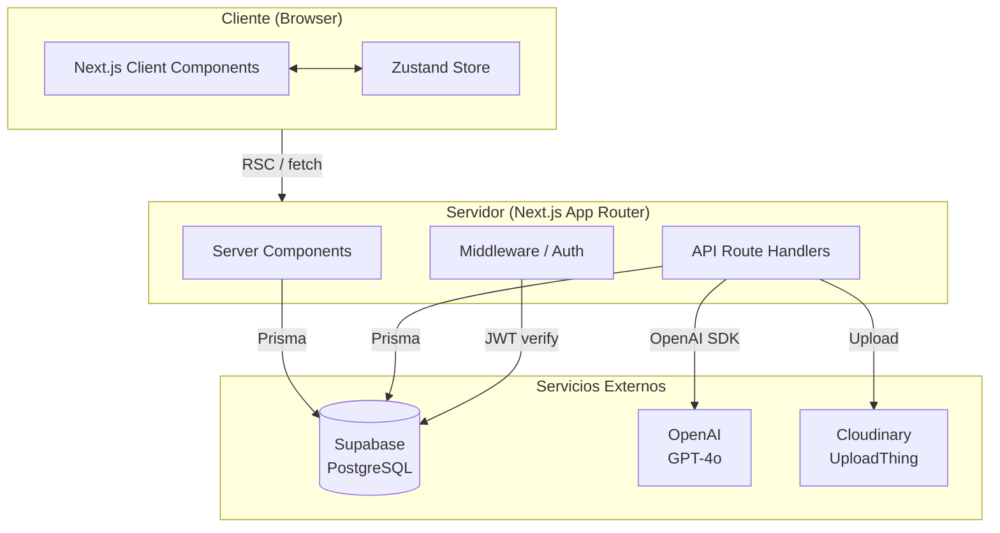
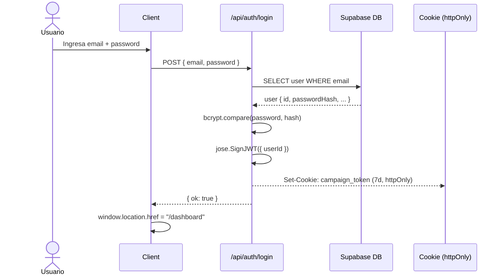
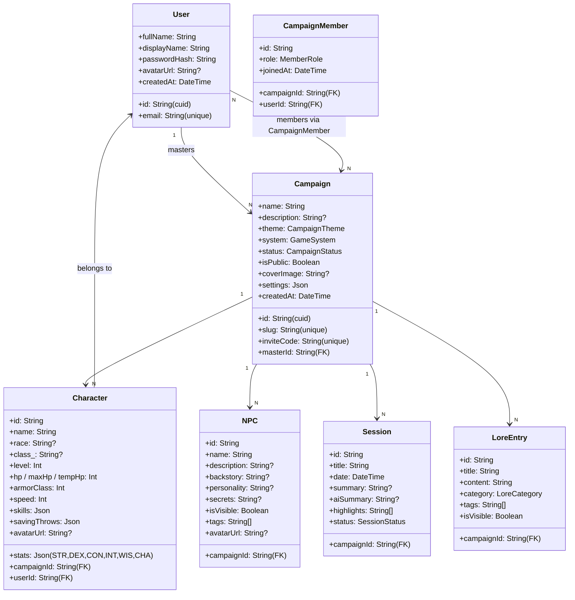
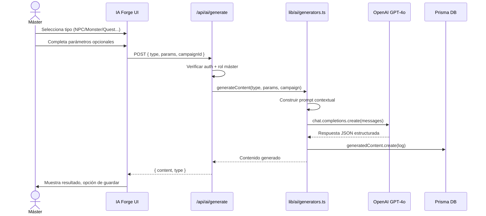

# CampaignForge — Documentación Técnica

**Versión:** 1.1 | **Última actualización:** 2026-06-04

---

## Stack tecnológico

| Capa | Tecnología | Versión |
|------|-----------|---------|
| Framework | Next.js (App Router) | 16.2.x |
| Runtime | React | 19.2.x |
| Lenguaje | TypeScript | 5.x |
| Estilos | Tailwind CSS + PostCSS | v4 |
| ORM | Prisma | v7 |
| Base de datos | PostgreSQL (Supabase) | 15+ |
| Auth | Supabase Auth + JWT (jose) + bcryptjs | — |
| IA | OpenAI SDK (GPT-4o) | — |
| Estado global | Zustand | v5 |
| Animaciones | Framer Motion | v12 |
| Componentes UI | Radix UI + shadcn/ui pattern | — |
| Íconos | Lucide React | — |
| Queries | TanStack React Query | v5 |
| Forms | React Hook Form + Zod | — |
| Upload | UploadThing + Cloudinary | — |
| Deploy | Vercel (recomendado) | — |

---

## Arquitectura del sistema



### Descripción de capas

| Capa | Responsabilidad |
|------|----------------|
| **Server Components** | Fetch de datos inicial (Prisma directo), validación de sesión con `getUser()`, renderizado HTML en servidor |
| **Client Components** | Interactividad, formularios, animaciones, estado local con `useState`, estado global con Zustand |
| **API Routes** | Mutaciones (POST/PUT/DELETE), llamadas a OpenAI, operaciones que requieren server-side logic |
| **Middleware** | Protección de rutas (redirigir `/` si no auth), validación JWT |
| **Zustand Store** | Estado de UI: sidebar open/close, dice tray, AI assistant panel |

---

## Autenticación — Flujo



**Token:** JWT firmado con `JWT_SECRET`, payload `{ userId, exp }`, cookie httpOnly 7 días.

**Lectura de sesión (Server):**
```ts
// lib/supabase/server.ts → getUser()
const token = cookies().get("campaign_token");
const { userId } = await jose.jwtVerify(token, secret);
return prisma.user.findUnique({ where: { id: userId } });
```

---

## Esquema de base de datos

### Entidades principales



### Entidades secundarias

| Entidad | Descripción |
|---------|-------------|
| `Monster` | Bestiario con stats, CR, habilidades, acciones |
| `Location` | Locaciones jerárquicas (región > zona > lugar) |
| `Faction` | Facciones con alineamiento y objetivos |
| `Item` | Objetos con rareza, propiedades, valor |
| `Quest` | Misiones con objetivos, estado, recompensa |
| `Note` | Notas privadas por usuario/campaña |
| `ChatRoom` | Salas de chat (public/private/master_only) |
| `ChatMessage` | Mensajes con tipo (text/dice_roll/system) |
| `DiceRoll` | Historial de tiradas |
| `VisualAid` | Imágenes de la galería |
| `GameMap` | Mapas con marcadores |
| `TimelineEvent` | Eventos de la línea de tiempo |
| `GeneratedContent` | Log de contenido generado por IA |

### Enums

| Enum | Valores |
|------|---------|
| `CampaignTheme` | FANTASY, HORROR, SCIFI, GRIMDARK, STEAMPUNK, WESTERN, MODERN, POSTAPOCALYPTIC, CUSTOM |
| `GameSystem` | DND5E, PATHFINDER2E, CALL_OF_CTHULHU, VAMPIRE_MASQUERADE, SHADOWRUN, STARFINDER, CUSTOM |
| `CampaignStatus` | ACTIVE, PAUSED, COMPLETED, ARCHIVED |
| `MemberRole` | MASTER, PLAYER |
| `SessionStatus` | PLANNED, IN_PROGRESS, COMPLETED |
| `LoreCategory` | HISTORY, GEOGRAPHY, CHARACTERS, MAGIC, RELIGION, POLITICS, OTHER |
| `ItemRarity` | COMMON, UNCOMMON, RARE, VERY_RARE, LEGENDARY, ARTIFACT |
| `QuestStatus` | ACTIVE, COMPLETED, FAILED, ABANDONED |

---

## API Routes

### Auth

| Método | Ruta | Descripción | Auth |
|--------|------|-------------|------|
| POST | `/api/auth/login` | Login con email/password, setea cookie JWT | No |
| POST | `/api/auth/register` | Registro de nuevo usuario | No |
| POST | `/api/auth/signout` | Borra cookie de sesión | No |
| GET | `/api/auth/create-profile` | Crea perfil en DB post-Supabase auth | Sí |

### Campañas

| Método | Ruta | Descripción | Auth |
|--------|------|-------------|------|
| GET | `/api/campaigns` | Lista campañas del usuario | Sí |
| POST | `/api/campaigns` | Crear nueva campaña | Sí |
| GET | `/api/campaigns/[id]` | Detalle de campaña | Sí |
| PUT | `/api/campaigns/[id]` | Editar campaña | Sí (master) |
| DELETE | `/api/campaigns/[id]` | Eliminar campaña | Sí (master) |
| POST | `/api/campaigns/join` | Unirse con código de invitación | Sí |
| GET | `/api/campaigns/by-slug/[slug]` | Campaña por slug | Sí |

### Personajes

| Método | Ruta | Descripción | Auth |
|--------|------|-------------|------|
| GET | `/api/characters` | Lista personajes de campaña | Sí |
| POST | `/api/characters` | Crear personaje | Sí |
| GET | `/api/characters/[id]` | Detalle de personaje | Sí |
| PUT | `/api/characters/[id]` | Actualizar personaje | Sí |
| DELETE | `/api/characters/[id]` | Eliminar personaje | Sí |

### IA

| Método | Ruta | Descripción | Auth |
|--------|------|-------------|------|
| POST | `/api/ai/generate` | Generar contenido (NPC, monstruo, quest, etc.) | Sí (master) |
| POST | `/api/ai/assistant` | Chat con asistente del máster | Sí (master) |

### Perfil

| Método | Ruta | Descripción | Auth |
|--------|------|-------------|------|
| PUT | `/api/profile` | Actualizar displayName o contraseña | Sí |

---

## Flujo de generación IA



---

## Estructura de archivos — Detalle

```
src/
├── app/
│   ├── (auth)/
│   │   ├── login/page.tsx          → Client, formulario login
│   │   └── register/page.tsx       → Client, formulario registro
│   ├── (dashboard)/
│   │   ├── layout.tsx              → Server, nav top + auth check
│   │   ├── dashboard/
│   │   │   ├── page.tsx            → Server, lista campañas + stats
│   │   │   ├── loading.tsx         → Skeleton de carga
│   │   │   └── new-campaign/       → Wizard 3 pasos
│   │   └── profile/page.tsx        → Client, cambiar nombre/contraseña
│   ├── (campaign)/[campaignSlug]/
│   │   ├── layout.tsx              → Server, auth + membresía + sidebar + topnav
│   │   ├── loading.tsx             → Skeleton de carga
│   │   ├── page.tsx                → Server, overview de campaña
│   │   ├── characters/             → List + [characterId]/page
│   │   ├── npcs/                   → List + [npcId]/page
│   │   ├── monsters/               → List + detail
│   │   ├── world/                  → Locaciones, facciones
│   │   ├── quests/                 → Lista de quests
│   │   ├── items/                  → Inventario global
│   │   ├── sessions/               → Lista + detalle
│   │   ├── lore/                   → Wiki con categorías
│   │   ├── gallery/                → Galería de imágenes
│   │   ├── notes/                  → Notas
│   │   ├── chat/                   → Salas de chat
│   │   ├── dice/                   → Página de dados
│   │   ├── ai-forge/               → Generador IA (master only)
│   │   └── settings/               → Config campaña (master only)
│   ├── api/                        → Route handlers
│   ├── not-found.tsx               → Página 404
│   ├── error.tsx                   → Error boundary global
│   ├── layout.tsx                  → Root layout (metadata, fonts)
│   └── globals.css                 → Design system tokens + utilities
├── components/
│   ├── layout/
│   │   ├── campaign-sidebar.tsx    → Sidebar colapsable + mobile overlay
│   │   └── top-nav.tsx             → Breadcrumb + acciones + hamburger mobile
│   ├── ai/
│   │   └── master-assistant.tsx    → Panel flotante chat IA
│   ├── dice/
│   │   └── dice-tray.tsx           → Panel flotante dados
│   └── ui/                         → Button, Input, Avatar, Badge, Dialog, etc.
├── lib/
│   ├── ai/generators.ts            → Constructores de prompt + llamadas OpenAI
│   ├── auth.ts                     → JWT sign/verify, bcrypt hash/compare
│   ├── prisma.ts                   → Singleton PrismaClient
│   ├── utils.ts                    → cn(), formatRelativeTime(), getThemeColors()
│   └── supabase/
│       ├── server.ts               → getUser(), createClient() server
│       └── client.ts               → createClient() browser
├── store/
│   └── campaign-store.ts           → Zustand: sidebar, diceTray, aiAssistant
└── types/
    └── index.ts                    → Tipos TypeScript derivados de Prisma
```

---

## Variables de entorno requeridas

| Variable | Descripción | Requerida |
|----------|-------------|-----------|
| `DATABASE_URL` | URL de conexión PostgreSQL (Supabase) | Sí |
| `NEXT_PUBLIC_SUPABASE_URL` | URL pública de Supabase | Sí |
| `NEXT_PUBLIC_SUPABASE_ANON_KEY` | Anon key de Supabase | Sí |
| `SUPABASE_SERVICE_ROLE_KEY` | Service role key (server-side) | Sí |
| `JWT_SECRET` | Secreto para firmar tokens JWT | Sí |
| `OPENAI_API_KEY` | API key de OpenAI (GPT-4o) | Sí |
| `CLOUDINARY_CLOUD_NAME` | Nombre del cloud en Cloudinary | Opcional |
| `CLOUDINARY_API_KEY` | API key de Cloudinary | Opcional |
| `CLOUDINARY_API_SECRET` | API secret de Cloudinary | Opcional |
| `UPLOADTHING_SECRET` | Secret de UploadThing | Opcional |
| `NEXT_PUBLIC_APP_URL` | URL pública del app (para OG tags) | Sí |

---

## Design system — CSS Variables

Ver `src/app/globals.css` para la lista completa. Variables principales:

| Token | Valor | Uso |
|-------|-------|-----|
| `--bg-base` | `#0a0a0f` | Fondo principal |
| `--bg-surface` | `#111118` | Tarjetas, panels |
| `--bg-elevated` | `#1a1a26` | Elementos elevados |
| `--text-primary` | `#f0ece6` | Texto principal |
| `--text-secondary` | `#9a9087` | Texto secundario |
| `--text-muted` | `#7a7470` | Texto terciario (4.5:1 contraste) |
| `--accent-gold` | `#c9a84c` | Acción primaria, CTAs |
| `--accent-arcane` | `#7c3aed` | IA, magia, arcano |
| `--accent-crimson` | `#8b1a1a` | Peligro, horror |
| `--font-display` | Cinzel | Títulos, headings |
| `--font-body` | Crimson Text | Texto narrativo, lore |
| `--font-ui` | Inter | UI, labels, datos |

Los temas de campaña (`data-theme="horror"`, `"scifi"`, `"grimdark"`) sobrescriben las variables de acento en `globals.css`.
