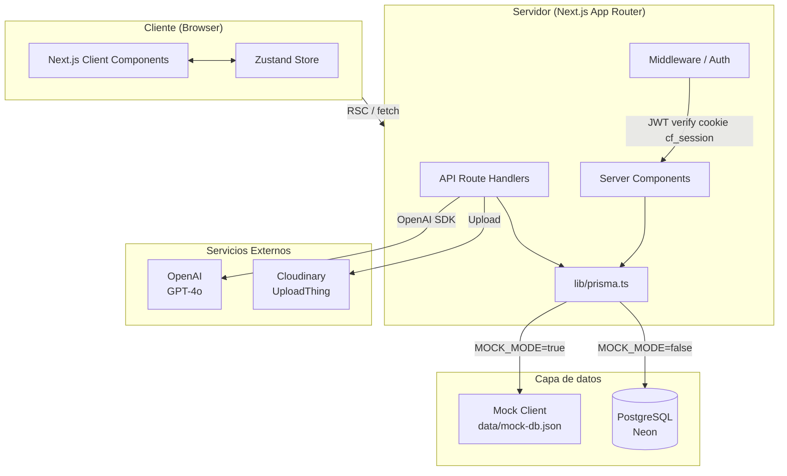
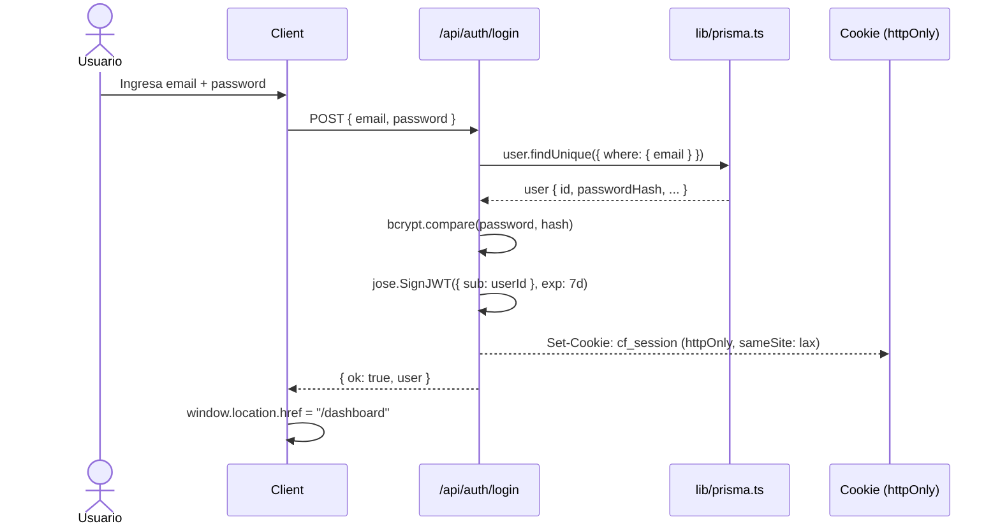
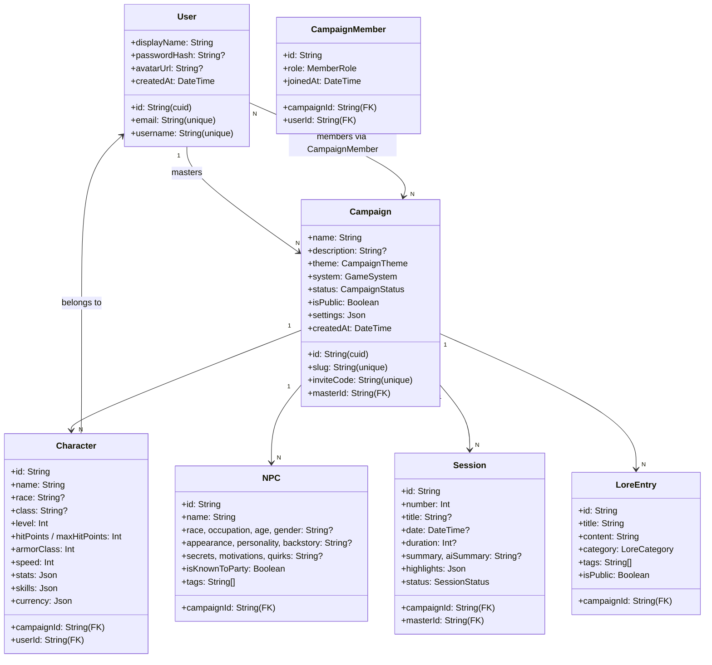
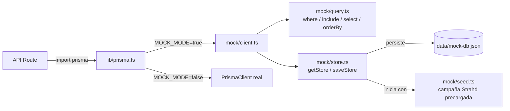
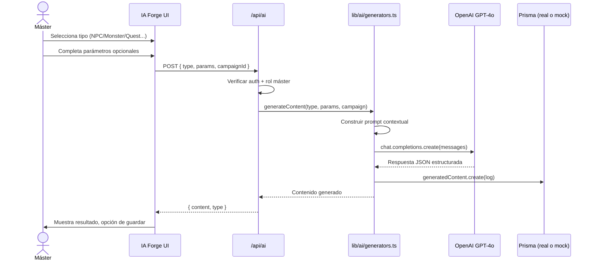

# CampaignForge — Documentación Técnica

**Versión:** 1.4 | **Última actualización:** 2026-06-04

---

## Stack tecnológico

| Capa | Tecnología | Versión |
|------|-----------|---------|
| Framework | Next.js (App Router) | 16.2.x |
| Runtime | React | 19.2.x |
| Lenguaje | TypeScript | 5.x |
| Estilos | Tailwind CSS + PostCSS | v4 |
| ORM | Prisma | v7 |
| Base de datos | PostgreSQL (Neon recomendado) | 15+ |
| Adaptador DB | `@prisma/adapter-pg` | v7 |
| Auth | JWT custom (`jose`) + bcryptjs | — |
| IA | OpenAI SDK (GPT-4o) | — |
| Estado global | Zustand | v5 |
| Animaciones | Framer Motion | v12 |
| Componentes UI | Radix UI + shadcn/ui pattern | — |
| Íconos | Lucide React | — |
| Queries | TanStack React Query | v5 |
| Forms | React Hook Form + Zod | — |
| Upload | UploadThing + Cloudinary | — |
| Deploy | Netlify (config presente) / Vercel | — |

> **Nota:** `@supabase/ssr` y `@supabase/supabase-js` están instalados pero no se usan activamente. `lib/supabase/server.ts` solo re-exporta `getSessionUser` de `lib/auth.ts` por compatibilidad de importaciones.

---

## Arquitectura del sistema



### Descripción de capas

| Capa | Responsabilidad |
|------|----------------|
| **Server Components** | Fetch de datos inicial (Prisma directo), validación de sesión con `getUser()`, renderizado HTML en servidor |
| **Client Components** | Interactividad, formularios, animaciones, estado local con `useState`, estado global con Zustand |
| **API Routes** | Mutaciones (POST/PUT/DELETE), llamadas a OpenAI, operaciones que requieren server-side logic |
| **Middleware** | Protección de rutas, validación JWT |
| **Zustand Store** | Estado de UI: sidebar open/close, dice tray, AI assistant panel |
| **Mock Layer** | Reemplaza Prisma cuando `MOCK_MODE=true`; cliente con misma API, respaldado en `data/mock-db.json` |

---

## Autenticación — Flujo



**Token:** JWT firmado con `JWT_SECRET`, payload `{ sub: userId }`, cookie `cf_session` httpOnly 7 días.

**Lectura de sesión (Server):**
```ts
// lib/auth.ts → getSessionUser()
const token = cookieStore.get("cf_session")?.value;
const userId = await verifyToken(token);              // jose.jwtVerify
return prisma.user.findUnique({ where: { id: userId } });
```

**Mock mode:** `loginUser()` omite `bcrypt.compare()` cuando `MOCK_MODE=true` (no hay hash real en seed). El JWT se genera igual — el resto del flujo es idéntico.

---

## Esquema de base de datos

### Entidades principales



### Entidades secundarias

| Entidad | Descripción |
|---------|-------------|
| `Monster` | Bestiario con stats, CR, habilidades, acciones legendarias |
| `Location` | Locaciones jerárquicas (parent/children recursivo) |
| `Faction` | Facciones con alineamiento, objetivos y secretos |
| `Item` | Objetos con rareza, propiedades JSON, atunement |
| `Quest` | Misiones con objetivos (Json array), estado, recompensa |
| `InventoryItem` | Inventario de personaje (join con Item opcional) |
| `CharacterSpell` | Hechizos de personaje con nivel y escuela |
| `Note` | Notas privadas por usuario/campaña/personaje |
| `ChatRoom` | Salas de chat (PUBLIC, PRIVATE, MASTER_ONLY) |
| `ChatMessage` | Mensajes con tipo (TEXT, DICE_ROLL, SYSTEM, WHISPER) |
| `DiceRoll` | Historial de tiradas con notación y resultados JSON |
| `VisualAid` | Galería de imágenes por campaña |
| `GameMap` | Mapas con marcadores JSON y fog of war |
| `TimelineEvent` | Eventos de la línea de tiempo con linkedEntities JSON |
| `GeneratedContent` | Log de contenido generado por IA con prompt y resultado |

### Enums

| Enum | Valores |
|------|---------|
| `CampaignTheme` | FANTASY, HORROR, SCIFI, GRIMDARK, STEAMPUNK, WESTERN, MODERN, POSTAPOCALYPTIC, CUSTOM |
| `GameSystem` | DND5E, PATHFINDER2E, CALL_OF_CTHULHU, VAMPIRE_MASQUERADE, SHADOWRUN, STARFINDER, CUSTOM |
| `CampaignStatus` | ACTIVE, PAUSED, COMPLETED, ARCHIVED |
| `MemberRole` | MASTER, PLAYER, SPECTATOR |
| `SessionStatus` | PLANNED, IN_PROGRESS, COMPLETED, CANCELLED |
| `LoreCategory` | GENERAL, HISTORY, RELIGION, MAGIC, POLITICS, GEOGRAPHY, CULTURE, BESTIARY, TECHNOLOGY |
| `ItemRarity` | COMMON, UNCOMMON, RARE, VERY_RARE, LEGENDARY, ARTIFACT |
| `QuestStatus` | ACTIVE, COMPLETED, FAILED, INACTIVE |
| `MapType` | WORLD, REGION, CITY, DUNGEON, BUILDING, CUSTOM |

> Los enums son tipos nativos de PostgreSQL. **No son compatibles con SQLite** — por eso el mock layer usa strings planos en lugar de SQLite.

---

## Mock Layer (`src/lib/mock/`)

Módulo que reemplaza Prisma para desarrollo sin base de datos, activado con `MOCK_MODE=true`.



| Archivo | Responsabilidad |
|---------|----------------|
| `mock/seed.ts` | Datos iniciales: 2 usuarios, campaña "La Maldición de Strahd", personaje, 3 NPCs, 2 quests, 3 sesiones, locaciones, facciones, lore |
| `mock/store.ts` | Store global en memoria + persistencia en `data/mock-db.json`. Sobrevive hot-reload via `globalThis._mockStore` |
| `mock/query.ts` | Motor de queries: `where` (AND/OR/NOT, operadores `in`, `contains`, relaciones `some`), `include` con relaciones anidadas, `_count`, `select`, `orderBy` |
| `mock/client.ts` | Clon de la API de Prisma: `findMany`, `findFirst`, `findUnique`, `create`, `update`, `updateMany`, `delete`, `deleteMany`, `upsert`, `count`, `$transaction` |

**Importante:** `lib/prisma.ts` usa `require()` dinámico para el cliente real, de modo que la app no crashea si `@prisma/client` no está generado.

---

## API Routes

### Auth

| Método | Ruta | Descripción | Auth |
|--------|------|-------------|------|
| POST | `/api/auth/login` | Login con email/password, setea cookie `cf_session` | No |
| POST | `/api/auth/register` | Registro de nuevo usuario | No |
| POST | `/api/auth/signout` | Borra cookie de sesión | No |
| GET | `/api/auth/demo-login` | Auto-login como `master@demo.com` → redirect dashboard | No |
| GET | `/api/auth/me` | Datos del usuario autenticado | Sí |

### Campañas

| Método | Ruta | Descripción | Auth |
|--------|------|-------------|------|
| GET | `/api/campaigns` | Lista campañas del usuario | Sí |
| POST | `/api/campaigns` | Crear nueva campaña | Sí |
| GET | `/api/campaigns/by-slug/[slug]` | Datos básicos de campaña por slug | Sí |
| POST | `/api/campaigns/join` | Unirse con código de invitación | Sí |

### Personajes y PNJs

| Método | Ruta | Descripción | Auth |
|--------|------|-------------|------|
| POST | `/api/characters` | Crear personaje | Sí (miembro) |
| POST | `/api/npcs` | Crear PNJ | Sí (master) |

### Contenido de campaña

| Método | Ruta | Descripción | Auth |
|--------|------|-------------|------|
| GET/POST | `/api/sessions` | Sesiones | Sí |
| GET/POST | `/api/lore` | Entradas de wiki/lore | Sí |
| GET/POST | `/api/gallery` | Galería visual | Sí |

### IA

| Método | Ruta | Descripción | Auth |
|--------|------|-------------|------|
| POST | `/api/ai` | Generar contenido (NPC, monstruo, quest, etc.) | Sí (master) |
| POST | `/api/ai/assistant` | Chat con asistente del máster | Sí (master) |

### Perfil

| Método | Ruta | Descripción | Auth |
|--------|------|-------------|------|
| PUT | `/api/profile` | Actualizar displayName o contraseña | Sí |

---

## Flujo de generación IA



> En mock mode, la llamada a OpenAI sigue requiriendo `OPENAI_API_KEY`. Si no está configurado, la ruta `/api/ai` devolverá error — esto es esperado.

---

## Estructura de archivos — Detalle

```
src/
├── app/
│   ├── (auth)/
│   │   ├── login/page.tsx           → Client, formulario login + Suspense para useSearchParams
│   │   └── register/page.tsx        → Client, formulario registro
│   ├── (dashboard)/
│   │   ├── layout.tsx               → Server, nav top + auth check
│   │   ├── dashboard/
│   │   │   ├── page.tsx             → Server, lista campañas + stats
│   │   │   ├── loading.tsx          → Skeleton de carga
│   │   │   └── new-campaign/        → Wizard 3 pasos
│   │   └── profile/page.tsx         → Client, cambiar nombre/contraseña
│   ├── (campaign)/[campaignSlug]/
│   │   ├── layout.tsx               → Server, auth + membresía + sidebar + topnav
│   │   ├── loading.tsx              → Skeleton de carga
│   │   ├── page.tsx                 → Server, overview de campaña
│   │   ├── characters/              → List + [characterId]/page
│   │   ├── npcs/                    → List + [npcId]/page
│   │   ├── monsters/                → Bestiario
│   │   ├── world/                   → Locaciones, facciones
│   │   ├── quests/                  → Lista de misiones
│   │   ├── items/                   → Inventario global
│   │   ├── sessions/                → Historial de sesiones
│   │   ├── lore/                    → Wiki con categorías
│   │   ├── gallery/                 → Galería de imágenes
│   │   ├── notes/                   → Notas privadas
│   │   ├── chat/                    → Salas de chat
│   │   ├── dice/                    → Página de dados
│   │   ├── ai-forge/                → Generador IA (master only)
│   │   └── settings/                → Config campaña (master only)
│   ├── api/                         → Route handlers
│   ├── not-found.tsx                → Página 404 "Tierra Inexplorada"
│   ├── error.tsx                    → Error boundary global
│   ├── layout.tsx                   → Root layout (metadata, fonts)
│   └── globals.css                  → Design system tokens + utilities
├── components/
│   ├── layout/
│   │   ├── campaign-sidebar.tsx     → Sidebar colapsable + overlay mobile
│   │   └── top-nav.tsx              → Breadcrumb + acciones + hamburger
│   ├── ai/
│   │   └── master-assistant.tsx     → Panel flotante chat IA
│   ├── dice/
│   │   └── dice-tray.tsx            → Panel flotante dados
│   └── ui/                          → Button, Input, Textarea, Select, Badge, etc.
├── lib/
│   ├── auth.ts                      → JWT sign/verify, bcrypt, loginUser, registerUser, getSessionUser
│   ├── prisma.ts                    → Switch condicional: mock client o PrismaClient real
│   ├── utils.ts                     → cn(), formatRelativeTime(), getThemeColors(), rollDice()
│   ├── mock/
│   │   ├── seed.ts                  → Datos iniciales de desarrollo (campaña precargada)
│   │   ├── store.ts                 → Store global + persistencia JSON
│   │   ├── query.ts                 → Motor de queries (where/include/select/orderBy)
│   │   └── client.ts                → Cliente Prisma falso con todos los modelos
│   ├── ai/generators.ts             → Constructores de prompt + llamadas OpenAI
│   └── supabase/
│       └── server.ts                → Re-exporta getSessionUser como getUser (compatibilidad)
├── store/
│   └── campaign-store.ts            → Zustand: sidebar, diceTray, aiAssistant
└── types/
    └── index.ts                     → Tipos TypeScript
```

---

## Variables de entorno

| Variable | Descripción | Mock mode | DB real |
|----------|-------------|-----------|---------|
| `MOCK_MODE` | `"true"` activa el mock layer | **Requerida** | No |
| `DATABASE_URL` | URL de conexión PostgreSQL | No necesaria | **Requerida** |
| `JWT_SECRET` | Secreto para firmar tokens JWT | Opcional (default dev) | **Requerida** |
| `OPENAI_API_KEY` | API key de OpenAI (GPT-4o) | Opcional | Opcional |
| `CLOUDINARY_*` | Credenciales Cloudinary | No | Opcional |
| `UPLOADTHING_SECRET` | Secret de UploadThing | No | Opcional |

---

## Design system — CSS Variables

Ver `src/app/globals.css` para la lista completa. Variables principales:

| Token | Valor | Uso |
|-------|-------|-----|
| `--bg-base` | `#0a0a0f` | Fondo principal |
| `--bg-surface` | `#111118` | Tarjetas, panels |
| `--bg-elevated` | `#1a1a26` | Elementos elevados |
| `--text-primary` | `#f0ece6` | Texto principal |
| `--text-secondary` | `#9a9087` | Texto secundario |
| `--text-muted` | `#7a7470` | Texto terciario (4.5:1 contraste WCAG AA) |
| `--accent-gold` | `#c9a84c` | Acción primaria, CTAs |
| `--accent-arcane` | `#7c3aed` | IA, magia, arcano |
| `--accent-crimson` | `#8b1a1a` | Peligro, horror |
| `--font-display` | Cinzel | Títulos, headings |
| `--font-body` | Crimson Text | Texto narrativo, lore |
| `--font-ui` | Inter | UI, labels, datos |

Los temas de campaña (`data-theme="horror"`, `"scifi"`, `"grimdark"`) sobrescriben las variables de acento en `globals.css`.
