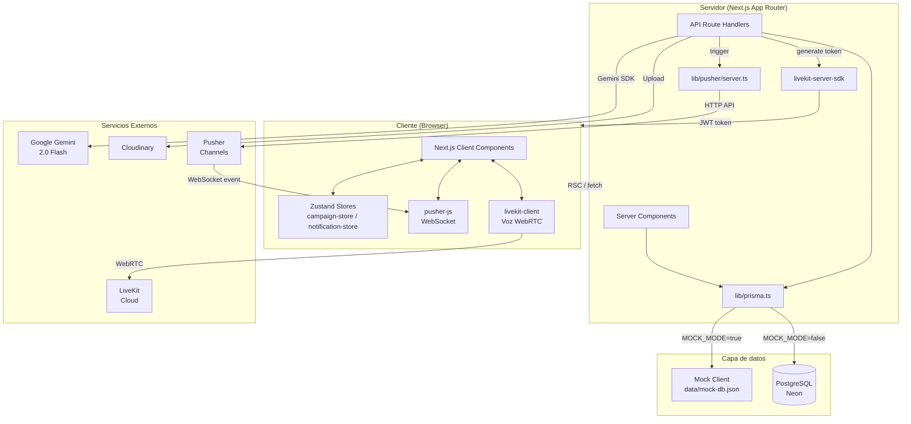
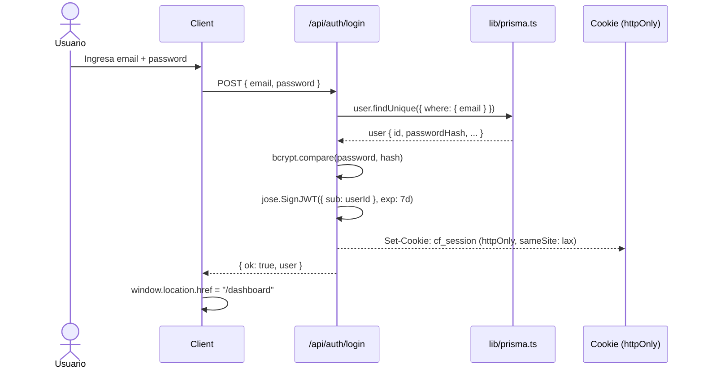
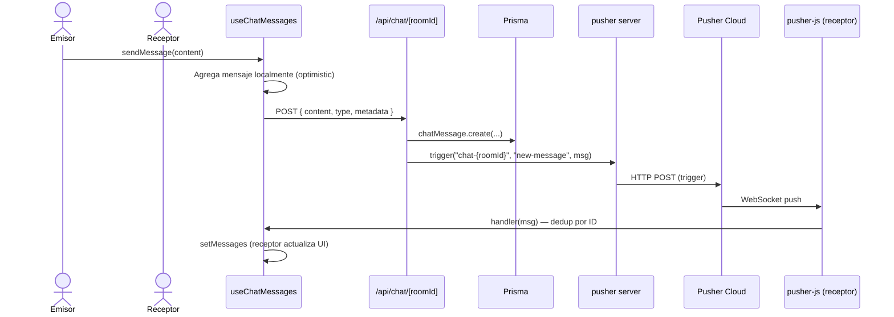
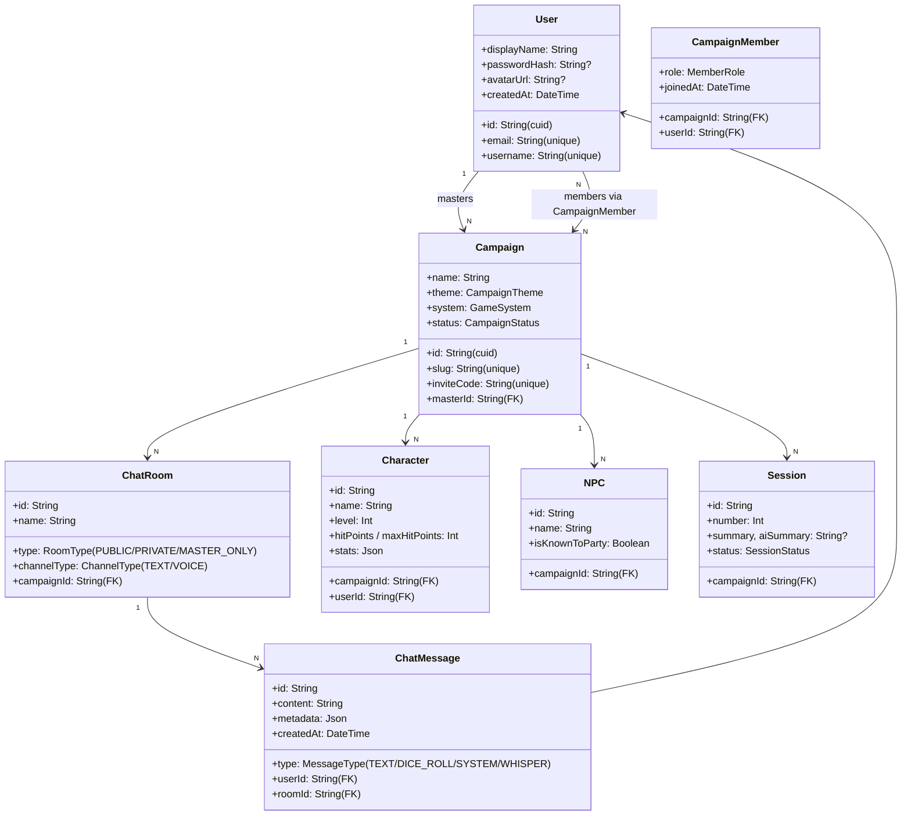
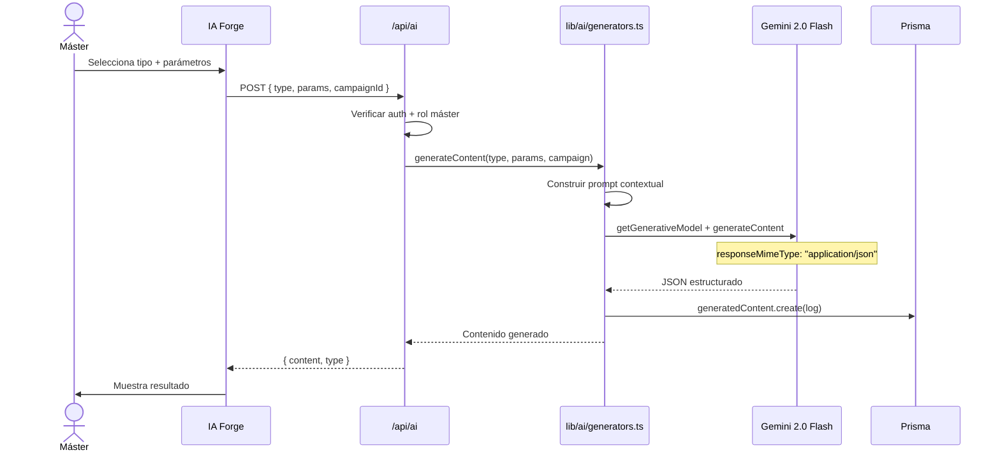

# CampaignForge — Documentación Técnica

**Versión:** 2.3 | **Última actualización:** 2026-06-08

---

## Stack tecnológico

| Capa | Tecnología | Versión |
|------|-----------|---------|
| Framework | Next.js (App Router) | 16.2.x |
| Runtime | React | 19.2.x |
| Lenguaje | TypeScript | 5.x |
| Estilos | Tailwind CSS + PostCSS | v4 |
| ORM | Prisma | v7 |
| Base de datos | PostgreSQL (Neon recomendado) | 15+ |
| Adaptador DB | `@prisma/adapter-pg` | v7 |
| Auth | JWT custom (`jose`) + bcryptjs | — |
| IA | Google Gemini 2.0 Flash (`@google/generative-ai`) | ^0.24.0 |
| Realtime (chat) | Pusher Channels (`pusher` + `pusher-js`) | ^5.3 / ^8.5 |
| Voz | LiveKit (`livekit-server-sdk` + `livekit-client`) | — |
| Notificaciones UI | Sonner | ^2.0 |
| Estado global | Zustand | v5 |
| Animaciones | Framer Motion | v12 |
| Componentes UI | Radix UI + shadcn/ui pattern | — |
| Íconos | Lucide React | — |
| Forms | React Hook Form + Zod | — |
| Imágenes | Cloudinary | — |
| Deploy | Vercel / Netlify (config presente) | — |

---

## Arquitectura del sistema

### Descripción de capas

| Capa | Responsabilidad |
|------|----------------|
| **Server Components** | Fetch de datos inicial (Prisma directo), validación de sesión con `getUser()`, renderizado HTML en servidor |
| **Client Components** | Interactividad, formularios, animaciones, estado local con `useState`, estado global con Zustand |
| **API Routes** | Mutaciones (POST/PUT/DELETE), llamadas a Gemini, trigger de eventos Pusher, generación de tokens LiveKit |
| **Zustand — campaign-store** | Estado de UI: sidebar open/close, dice tray, AI assistant panel, `chatSendMessage` ref, `masterHidingRolls` |
| **Zustand — notification-store** | `unreadChatCount`: incrementado por `CampaignRealtime` al recibir mensajes ajenos; limpiado al entrar al chat |
| **CampaignRealtime** | Componente null-render montado en el layout. Suscribe al canal Pusher de campaña y al canal de chat. Llama `router.refresh()` ante eventos de datos, muestra toasts al máster |
| **useChatMessages** | Hook: carga inicial via API + suscripción realtime Pusher. Deduplicación de mensajes por ID |
| **Mock Layer** | Reemplaza Prisma cuando `MOCK_MODE=true`; cliente con misma API, respaldado en `data/mock-db.json` |

---

## Autenticación — Flujo

**Token:** JWT firmado con `JWT_SECRET`, payload `{ sub: userId }`, cookie `cf_session` httpOnly 7 días.

---

## Chat en tiempo real — Flujo Pusher

---

## Esquema de base de datos

### Entidades principales

### Entidades secundarias

| Entidad | Descripción |
|---------|-------------|
| `Monster` | Bestiario con stats, CR, habilidades, acciones legendarias |
| `Location` | Locaciones jerárquicas (parent/children recursivo) |
| `Faction` | Facciones con alineamiento, objetivos y secretos |
| `Item` | Objetos con rareza, propiedades JSON, atunement |
| `Quest` | Misiones con objetivos (Json array), estado, recompensa |
| `LoreEntry` | Wiki con categorías y visibilidad por rol |
| `Note` | Notas privadas por usuario/campaña |
| `VisualAid` | Galería de imágenes por campaña |
| `DiceRoll` | Historial de tiradas con notación y resultados JSON |
| `GameMap` | Mapas con marcadores JSON y fog of war |
| `TimelineEvent` | Eventos de la línea de tiempo |
| `GeneratedContent` | Log de contenido generado por IA |

---

## API Routes

### Auth

| Método | Ruta | Descripción | Auth |
|--------|------|-------------|------|
| POST | `/api/auth/login` | Login con email/password, setea cookie `cf_session` | No |
| POST | `/api/auth/register` | Registro de nuevo usuario | No |
| POST | `/api/auth/signout` | Borra cookie de sesión | No |
| GET | `/api/auth/me` | Datos del usuario autenticado | Sí |

### Campañas

| Método | Ruta | Descripción | Auth |
|--------|------|-------------|------|
| GET | `/api/campaigns` | Lista campañas del usuario | Sí |
| POST | `/api/campaigns` | Crear nueva campaña | Sí |
| GET | `/api/campaigns/by-slug/[slug]` | Datos básicos de campaña por slug | Sí |
| POST | `/api/campaigns/join` | Unirse con código + trigger Pusher `member-joined` | Sí |

### Personajes y NPCs

| Método | Ruta | Descripción | Auth |
|--------|------|-------------|------|
| POST | `/api/characters` | Crear personaje + trigger Pusher `character-created` | Sí (miembro) |
| POST | `/api/npcs` | Crear NPC | Sí (master) |

### Chat

| Método | Ruta | Descripción | Auth |
|--------|------|-------------|------|
| GET | `/api/chat/rooms` | Lista salas de texto/voz por campaña | Sí |
| GET | `/api/chat/[roomId]` | Lista mensajes con paginación | Sí |
| POST | `/api/chat/[roomId]` | Enviar mensaje + trigger Pusher `new-message` | Sí |

### Contenido de campaña

| Método | Ruta | Descripción | Auth |
|--------|------|-------------|------|
| GET/POST | `/api/sessions` | Sesiones | Sí |
| GET/POST | `/api/lore` | Entradas de wiki/lore | Sí |
| GET/POST | `/api/gallery` | Galería visual | Sí |

### IA

| Método | Ruta | Descripción | Auth |
|--------|------|-------------|------|
| POST | `/api/ai` | Generar contenido (NPC, monstruo, quest, etc.) via Gemini | Sí (master) |
| POST | `/api/ai/assistant` | Chat contextual con asistente del máster | Sí (master) |

### Perfil

| Método | Ruta | Descripción | Auth |
|--------|------|-------------|------|
| PUT | `/api/profile` | Actualizar displayName o contraseña | Sí |

---

## Flujo de generación IA (Gemini)

**Asistente del Máster:** usa `model.startChat()` con historial mapeado (`assistant` → `model` para Gemini).

---

## Variables de entorno

| Variable | Descripción | Mock | DB real |
|----------|-------------|------|---------|
| `MOCK_MODE` | `"true"` activa el mock layer | **Requerida** | No |
| `DATABASE_URL` | URL de conexión PostgreSQL | No | **Requerida** |
| `JWT_SECRET` | Secreto JWT (mín. 32 chars en prod) | Opcional | **Requerida** |
| `GEMINI_API_KEY` | API key de Google Gemini | Opcional | Opcional |
| `PUSHER_APP_ID` | ID de la app Pusher | No | Recomendada |
| `PUSHER_SECRET` | Secret de la app Pusher | No | Recomendada |
| `NEXT_PUBLIC_PUSHER_KEY` | Key pública Pusher | No | Recomendada |
| `NEXT_PUBLIC_PUSHER_CLUSTER` | Cluster Pusher (`us2`, `eu`, etc.) | No | Recomendada |
| `LIVEKIT_API_KEY` | API key de LiveKit | No | Para voz |
| `LIVEKIT_API_SECRET` | Secret LiveKit | No | Para voz |
| `NEXT_PUBLIC_LIVEKIT_URL` | URL WebSocket LiveKit | No | Para voz |
| `CLOUDINARY_*` | Credenciales Cloudinary | No | Para imágenes |

---

## Design system — CSS Variables

| Token | Valor | Uso |
|-------|-------|-----|
| `--bg-base` | `#0a0a0f` | Fondo principal |
| `--bg-surface` | `#111118` | Tarjetas, panels |
| `--bg-elevated` | `#1a1a26` | Elementos elevados |
| `--text-primary` | `#f0ece6` | Texto principal |
| `--text-secondary` | `#9a9087` | Texto secundario |
| `--text-muted` | `#7a7470` | Texto terciario (4.5:1 WCAG AA) |
| `--accent-gold` | `#c9a84c` | Acción primaria, CTAs |
| `--accent-arcane` | `#7c3aed` | IA, magia, arcano |
| `--font-display` | Cinzel | Títulos |
| `--font-body` | Crimson Text | Texto narrativo |
| `--font-ui` | Inter | UI, labels |
